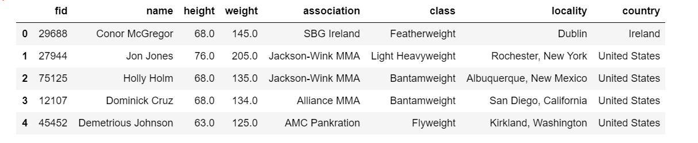
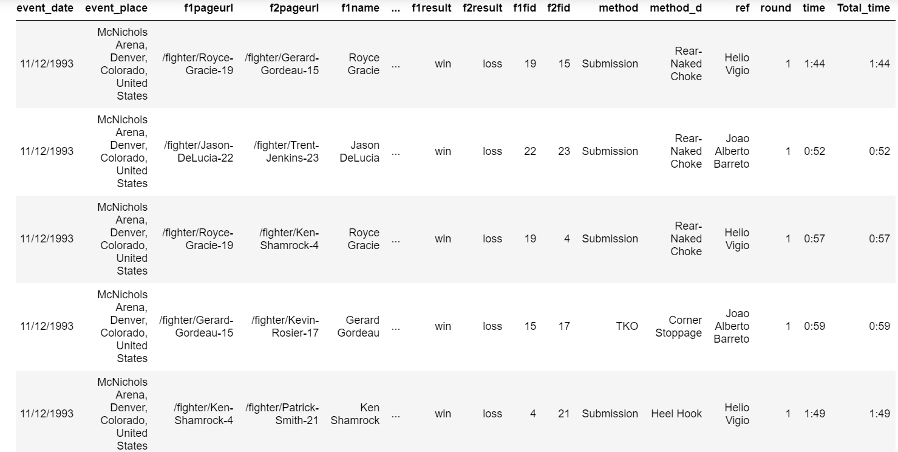
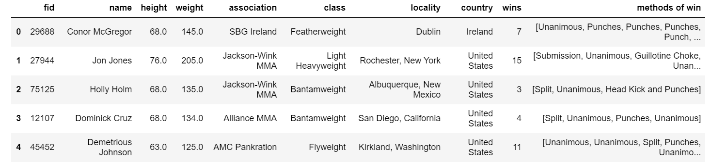
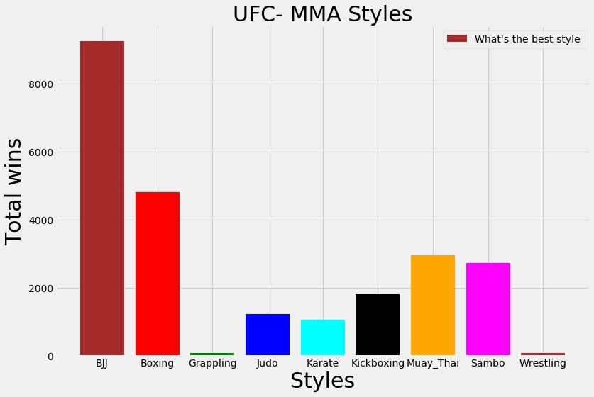
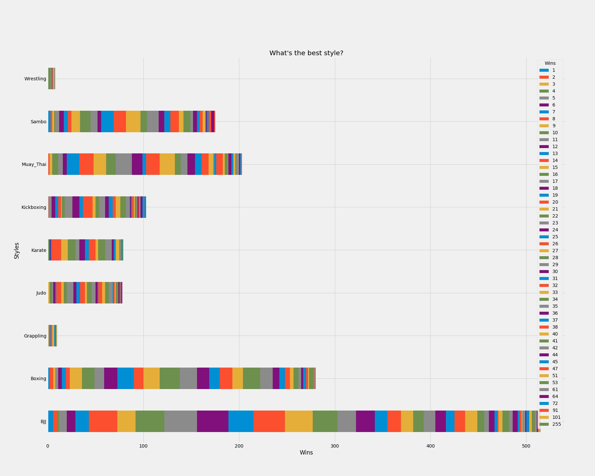

# Data-Analysis--UFC-data
Here, whole process of data mining (Data Understanding, Data Preparation, Modeling, and Evaluation) is done. Scraped raw data is cleaned and some statistical analysis is done. **'What is the best fighting style?'** is answered based on the data.

**Two different data sets were merged for effectiveness**

# Fighters dataset: 
This contains the general information on the fighters oneself. A snippet of this data set is as follows:

# Fights dataset:
This contains the collection of all the fights a particular fighters has under the promotion of Ultimate Fighting Championship(UFC).
A snippet of this data set is as follows:

Real data is never clean. We need to make sure we clean the data by converting or getting rid of null or missing values. Then extracting the essential attributes from each dataset and merging together to form a single dataset with fighters and their personal attributes along with the collection of their fights with its own attributes. Something like:

## Here starts the Exploration
# Which is the best martial art discipline?

**Classifying fighters into 10 different fighting disciplines.** Taken from Reference paper:Mixed Membership Martial Arts:Data-Driven Analysis of Winning Martial Arts Styles.

**BOXING, SUBMISSION(BJJ), TAKEDOWNS(JUDO, WRESTLING, SAMBO), STRIKES(KARATE, MUAY THAI)**

This is done by taking into account how each fighters are winning their fights. Each of these fighting styles have collection of winning methods. By utilizing similar index like cosine similarity, each fighters are designated with one of the fighting discipline.

